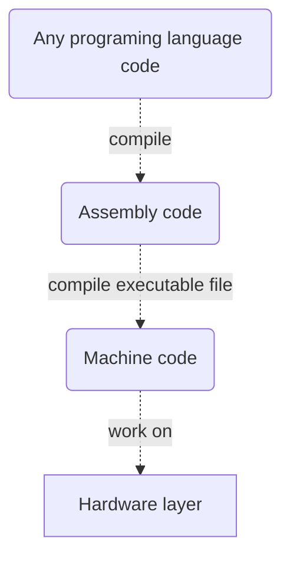

# 2nd Tutorial
In this tutorial 'll be on difference between .net framework & c# programing language. Firstly, we to understand what's a framework & programing language.

## What's mean the programing language:
In summary, "A programming language is any set of rules that converts strings, or graphical program elements in the case of visual programming languages, to various kinds of machine code output. Programming languages are one kind of computer language, and are used in computer programming to implement algorithms." [(Wikipedia)](https://en.wikipedia.org/wiki/Programming_language)

A developed software by any programing language  works on a hardware layer, so how works this? The Cpu occurs from logic circuits and this logic circuits contain millions of transistors. Millions of transistors, think on these. How ? How do a program work on a hardware contain millions of transistor ? If we are confused, now we could try to meaning. If we are confused, now we could try to meaning. 

Firstly, a processor implement a machine codes instructions, the machine codes has been contain 1s (logic 1 so there is voltage) and 0s (logic 0 so there isn't voltage). Before it was developed programing languages, the computers works punched card. The punched cards was containing basic machine codes. The punched cards was containing basic machine codes. The machine codes was being developed by programers and plug in computer by a operator and the computer was proccesing the machine codes. A few time later, to facilitate this process some engineers was developed to first programing language (__*Assembly*__, 1949). Assembly language contains basic commands as like mov, sub, push and this commands using than more easy from machine codes. But again the assembly language was hard, therefore some engineers were developed __*Fortan*__ programing language closest to today programing languages. After a while, other programing languages were born. When a code is compiled in a programming language, then be the reverse of the developmental process. So a code turn into machine code.

## C# programing language:
