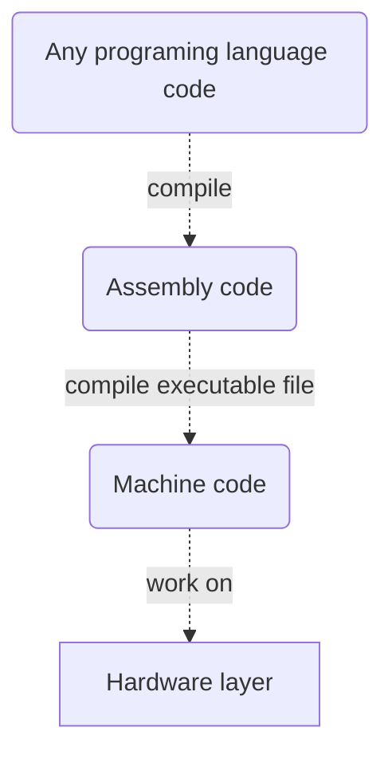

# 2nd Tutorial
In this tutorial 'll be on difference between .net framework & c# programing language. Firstly, we to understand what's a framework & programing language.

## What's mean the programing language:
In summary, "A programming language is any set of rules that converts strings, or graphical program elements in the case of visual programming languages, to various kinds of machine code output. Programming languages are one kind of computer language, and are used in computer programming to implement algorithms." [(Wikipedia)](https://en.wikipedia.org/wiki/Programming_language)

A developed software by any programing language  works on a hardware layer, so how works this? The Cpu occurs from logic circuits and this logic circuits contain millions of transistors. Millions of transistors, think on these. How ? How do a program work on a hardware contain millions of transistor ? If we are confused, now we could try to meaning. If we are confused, now we could try to meaning. 

Firstly, a processor implement a machine codes instructions, the machine codes has been contain 1s (logic 1 so there is voltage) and 0s (logic 0 so there isn't voltage). Before it was developed programing languages, the computers works punched card. The punched cards was containing basic machine codes. The punched cards was containing basic machine codes. The machine codes was being developed by programers and plug in computer by a operator and the computer was proccesing the machine codes. A few time later, to facilitate this process some engineers was developed to first programing language (__*Assembly*__, 1949). Assembly language contains basic commands as like mov, sub, push and this commands using than more easy from machine codes. But again the assembly language was hard, therefore some engineers were developed __*Fortan*__ programing language closest to today programing languages. After a while, other programing languages were born. When a code is compiled in a programming language, then be the reverse of the developmental process. So a code turn into machine code.

## About on C# programing language:
"C# is pronounced "C-Sharp".

It is an object-oriented programming language created by Microsoft that runs on the .NET Framework.

C# has roots from the C family, and the language is close to other popular languages like C++ and Java.

The first version was released in year 2002. The latest version, C# 8, was released in September 2019." [(w3schools)](https://www.w3schools.com/cs/cs_intro.php)

## About on Frameworks:
"In computer programming, a software framework is an abstraction in which software, providing generic functionality, can be selectively changed by additional user-written code, thus providing application-specific software. It provides a standard way to build and deploy applications and is a universal, reusable software environment that provides particular functionality as part of a larger software platform to facilitate the development of software applications, products and solutions. Software frameworks may include support programs, compilers, code libraries, toolsets, and application programming interfaces (APIs) that bring together all the different components to enable development of a project or system." [(Wikipedia)](https://en.wikipedia.org/wiki/Software_framework)

## About on .Net Frameworks:
The .NET Framework (pronounced as "dot net") is a proprietary software framework developed by Microsoft that runs primarily on Microsoft Windows. It was the predominant implementation of the Common Language Infrastructure (CLI) until being superseded by the cross-platform .NET project. It includes a large class library called Framework Class Library (FCL) and provides language interoperability (each language can use code written in other languages) across several programming languages. Programs written for .NET Framework execute in a software environment (in contrast to a hardware environment) named the Common Language Runtime (CLR). The CLR is an application virtual machine that provides services such as security, memory management, and exception handling. As such, computer code written using .NET Framework is called "managed code". FCL and CLR together constitute the .NET Framework. [(Wikipedia)](https://en.wikipedia.org/wiki/.NET_Framework)
